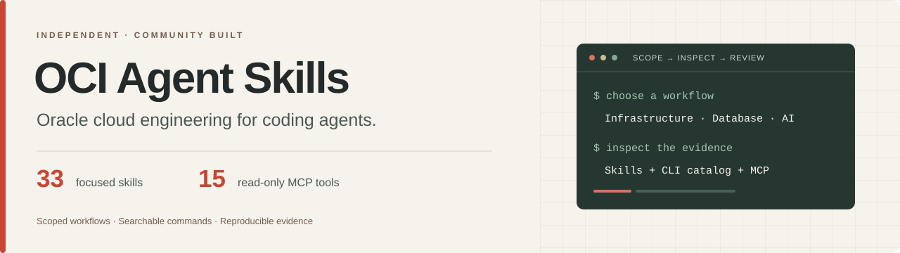
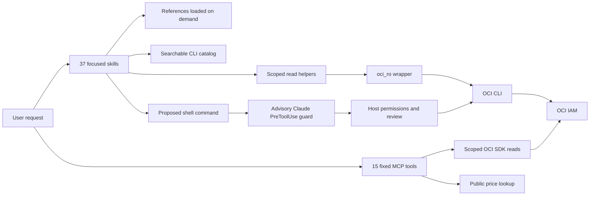

# OCI Agent Skills



**Oracle cloud engineering, from the first diagnostic to a reviewed change plan.**

37 focused skills, a searchable OCI command catalog and 15 bounded, read-only MCP tools for infrastructure, Oracle Database, APEX, AI and delivery workflows.

[](docs/validation-matrix.md)
[](docs/skills.md)
[](docs/mcp-tools.md)
[](docs/audit.md)
[](LICENSE)

**v2 skill set · package 0.2.1 (preview)** — [23 validation gates pass; 5 remain open](docs/validation-matrix.md). Independent community project, not affiliated with Oracle.

[Get started](#get-started) · [Browse skills](docs/skills.md) · [MCP reference](docs/mcp-tools.md) · [Evidence](#evidence-you-can-inspect) · [Documentation](docs/README.md)

**Reviewing the preview?** Start with the [technical review pack](docs/review/README.md): a short Portuguese PDF, a reproducible five-minute demo and focused feedback prompts.

## In 30 seconds

These requests come from the evaluation corpus. The table describes the intended workflow, not a recorded agent execution or fabricated cloud output.

| Ask your agent | Skill | What it helps you do |
|---|---|---|
| “port 80 is open in the security list but the site still times out from outside” | [oci-networking](skills/oci-networking/SKILL.md) | Inspect scoped VCNs, subnets and NSG rules; trace the failing hop before proposing a rule change. |
| “tô tomando NotAuthorizedOrNotFound em tudo, mas o usuário é admin. como descubro com qual identidade o cli tá autenticando?” | [oci-cli-auth](skills/oci-cli-auth/SKILL.md) | Establish profile identity and region subscriptions; distinguish missing resources from missing access. |
| “launch an ARM VM.Standard.A1.Flex with 2 ocpus and 12gb in my dev compartment” | [oci-compute](skills/oci-compute/SKILL.md) | Read shape and image compatibility, then prepare a scoped launch and recovery plan for review. |

Reads retain explicit scope and bounded output. The Claude Bash guard reviews recognized writes; mutation recipes are marked **shape-verified only**. [Corpus and evaluation limits →](docs/evals.md)

## Get started

Prerequisites: Python 3.13+, `uv`, and OCI CLI 3.91.0 for the reproducible baseline. Configure your OCI profile outside the checkout when you need credentialed reads. Offline smoke tests require no cloud credentials.

Clone this repository, then run these two commands from its root:

```bash
uv sync --frozen --project runtime
claude --plugin-dir .
```

For a self-contained copy, project adapters and runtime configuration, follow the [installation guide](docs/install.md).

| Host | Entry point | Shell guard supplied by this pack |
|---|---|---|
| Claude Code | Native plugin; full, database or DevOps selection | Advisory Bash `PreToolUse` hook |
| Codex | Plugin manifest or copy installer `--host codex` | **UNGUARDED** |
| Gemini CLI | Copy installer `--host gemini` | **UNGUARDED** |
| Cursor | Copy installer `--host cursor` | **UNGUARDED** |
| OpenCode v2 | Copy installer `--host opencode` | **UNGUARDED** |
| Other MCP clients | Bundled stdio server | Fixed read-only tools; shell controls belong to the host |

The four unguarded copy adapters require `--i-accept-unguarded`. Host configuration and launcher checks do not establish interactive compatibility with every host version. IAM remains the cloud access boundary.

## What's inside

Each skill combines a scope check, symptom-based routing, command examples, focused references and failure modes. The [full catalog](docs/skills.md) shows verification labels, helper scripts, references and read examples for every skill.

<!-- skills:start -->
| Domain | Skill | Purpose |
|---|---|---|
| Navigation, identity & governance | [oci-navigator](skills/oci-navigator/SKILL.md) | Finds non-database CLI groups on current OCI. |
|  | [oci-cli-auth](skills/oci-cli-auth/SKILL.md) | Fixes OCI CLI authentication, identity and query problems. |
|  | [oci-tenancy-governance](skills/oci-tenancy-governance/SKILL.md) | Designs and audits OCI tenancy guardrails: compartment topology, tag namespaces, cost-tracking tags, quotas, budgets, landing zones, organizations and child tenancies. |
|  | [oci-iam-policy](skills/oci-iam-policy/SKILL.md) | Authors OCI IAM statements and identity domains. |
|  | [oci-support-limits](skills/oci-support-limits/SKILL.md) | Answers "can I actually create this" and files the request when the answer is no: service limits vs compartment quotas vs physical capacity, resource-availability per AD, limit-increase requests, and OCI support incidents. |
| Compute, network & storage | [oci-compute](skills/oci-compute/SKILL.md) | Launches, resizes and triages OCI Compute. |
|  | [oci-networking](skills/oci-networking/SKILL.md) | Builds and debugs OCI VCN networking. |
|  | [oci-object-storage](skills/oci-object-storage/SKILL.md) | Operates OCI Object Storage. |
|  | [oci-block-file-storage](skills/oci-block-file-storage/SKILL.md) | Operates OCI block, boot and File Storage. |
|  | [oci-bastion-access](skills/oci-bastion-access/SKILL.md) | Reaches a private OCI host or database through OCI Bastion. |
| Delivery & infrastructure as code | [oci-oke](skills/oci-oke/SKILL.md) | Creates and operates OKE Kubernetes clusters. |
|  | [oci-devops-pipelines](skills/oci-devops-pipelines/SKILL.md) | Builds OCI DevOps CI/CD. |
|  | [oci-serverless](skills/oci-serverless/SKILL.md) | Deploys OCI Functions, Container Instances and API Gateway. |
|  | [oci-terraform](skills/oci-terraform/SKILL.md) | Authors and reviews OCI Terraform/OpenTofu and drives Resource Manager stacks. |
| Operations & security | [oci-monitoring-alarms](skills/oci-monitoring-alarms/SKILL.md) | Queries OCI metrics and sets alarms, including Stack Monitoring. |
|  | [oci-logging-audit](skills/oci-logging-audit/SKILL.md) | Searches OCI logs and Audit events. |
|  | [oci-incident-triage](skills/oci-incident-triage/SKILL.md) | Read-only runbook for an OCI resource that is down or degraded: alarm state, recent Audit mutations, Cloud Guard, metrics, logs, work requests, maintenance events and limits, then ranked hypotheses. |
|  | [oci-security-posture](skills/oci-security-posture/SKILL.md) | Audits OCI security posture against CIS. |
|  | [oci-vault-certificates](skills/oci-vault-certificates/SKILL.md) | Handles OCI Vault, KMS keys, Secrets and Certificates. |
| Cost & Free Tier | [oci-cost-analysis](skills/oci-cost-analysis/SKILL.md) | Explains an OCI bill and estimates cost before provisioning: `usage-api` summarized usage, cost and FOCUS exports, budgets and alert rules, cost-tracking tags, and the credential-free Price List API. |
|  | [oci-free-tier](skills/oci-free-tier/SKILL.md) | Explains OCI Always Free allotments and trial lifecycle. |
|  | [oci-finops-waste](skills/oci-finops-waste/SKILL.md) | Finds unused OCI resources and prices potential waste. |
| Oracle Database & APEX | [oracle-autonomous-db](skills/oracle-autonomous-db/SKILL.md) | Provisions and connects Oracle Autonomous Database. |
|  | [oracle-db-fleet](skills/oracle-db-fleet/SKILL.md) | Operates OCI non-Autonomous database services and enrolled Database Management fleets. |
|  | [oracle-db-vector-ai](skills/oracle-db-vector-ai/SKILL.md) | Builds vector search and Select AI inside Oracle Database 26ai/23ai. |
|  | [oracle-db-sql-access](skills/oracle-db-sql-access/SKILL.md) | Configures agent SQL access with database-enforced read privileges, SQLcl MCP, ORDS and Database Tools. |
|  | [oracle-apex](skills/oracle-apex/SKILL.md) | Delivers Oracle APEX. |
| AI & data | [oci-generative-ai](skills/oci-generative-ai/SKILL.md) | Plans OCI GenAI inference and agents. |
|  | [oci-ai-services](skills/oci-ai-services/SKILL.md) | Uses OCI pretrained AI services: Vision, Language (nested `oci ai language`) sentiment/PII/translation, Speech transcription and TTS, Document Understanding. |
|  | [oci-data-platform](skills/oci-data-platform/SKILL.md) | Moves and processes data on OCI: Streaming (Kafka-compatible) and Queue, Data Flow Spark, Data Integration, Data Catalog, GoldenGate CDC, Big Data Service, Batch, OpenSearch, Redis, and Data Science jobs and model deployments. |
| Reliability & migration | [oci-dr-backup](skills/oci-dr-backup/SKILL.md) | Assesses OCI recovery and backup retention. |
|  | [oci-migration-patching](skills/oci-migration-patching/SKILL.md) | Migrates and patches OCI fleets: Cloud Migrations, Cloud Bridge, Database Migration and ZDM, Rover, OS Management Hub, Ksplice, Java Management Service, Fleet Application Management, Exadata Fleet Update, OCVS. |
|  | [oci-migration-assess](skills/oci-migration-assess/SKILL.md) | Normalizes AWS, Azure and GCP inventory for OCI assessment. |
|  | [oci-migration-map](skills/oci-migration-map/SKILL.md) | Maps cloud inventory to OCI targets and scoped price comparisons. |
|  | [oci-migration-landing-zone](skills/oci-migration-landing-zone/SKILL.md) | Drafts OCI Core Landing Zone variables from assessed inventory. |
| SDKs & enterprise applications | [oci-sdk-patterns](skills/oci-sdk-patterns/SKILL.md) | Writes OCI SDK code that works. |
|  | [oracle-enterprise-apps](skills/oracle-enterprise-apps/SKILL.md) | Explains Oracle application business APIs versus OCI environment APIs. |
<!-- skills:end -->

## How it fits together



Skill bodies and references load on demand. `scripts/catalog.py` searches command shapes without loading the entire census. The MCP exposes fixed operations, explicit compartment scopes and bounded pages; it provides no arbitrary CLI, SQL or SDK executor. [Architecture and contracts →](docs/foundation.md)

## Safety model

- **Measured OCI classification:** 9,145 CLI leaves, all 278 critical-labelled leaves denied, and zero allows outside the strict read-only set. The severity snapshot shares the catalog's generator; it is not an independent taxonomy. [Matrix and invariant](docs/evidence/guard-severity-matrix.json).
- **Review before change:** danger flags, including `--force`, never lower severity. Unknown OCI leaves and modified helper hashes ask for review. Unrecognized commands return no decision and retain host permissions.
- **Read-only runtime:** fixed MCP dispatch and scoped helper wrappers constrain the operations they expose. The Bash hook is advisory and does not intercept generic MCP executors or protect other host shells.
- **Untrusted results:** names, tags, logs and other returned values are data. Sanitized evidence and inert safety fixtures are checked; live resistance to prompt injection remains unmeasured.

The frozen Oracle denylist comparison permits 374 destructive-labelled leaves under current prefix replay; this measures a snapshot, not today's upstream server behavior. The [audit](docs/audit.md) preserves the matching rules, census false positives, source revisions and known gaps. Terraform, kubectl, SQL and APEX guard rules are outside the measured OCI matrix.

## Evidence you can inspect

| Check | Recorded result | Scope |
|---|---:|---|
| Regression suite | 453 passed | Current full suite; recorded in the validation matrix |
| Authored OCI fences | 285/285 valid | CLI shape lint, not workload execution |
| Negative routing prompts | 0/40 fired in each of two trials | Isolated semantic classifier; dated evidence |
| Semantic skill selection | 80/80 and 80/80 | Zero disagreements in the recorded trials; [ownership repair and evidence](docs/evals.md#current-ownership-repair) |
| OCI CLI census | 9,145 leaves / 174 groups | Includes aliases; not complete product coverage |
| Full release matrix | 23 pass / 5 open | Open gates retain owners and reasons |

[Validation matrix](docs/validation-matrix.md) · [Evaluation method](docs/evals.md) · [Semantic investigation and limits](docs/semantic-routing.md)

The [ownership contracts](docs/routing-contracts.md) explain the implemented
routing repair. The [historical reliability study](docs/routing-reliability.md)
covers the original errors, calibrated uncertainty and task evaluation still needed. It also identifies the official `oracle/skills`
repository as a prospective baseline; the archived comparison below is unchanged.

The archived four-arm comparison below dates from September 9, before the scope repairs. It uses the same frozen prompts and static matcher for every arm. These figures measure authored material and inert guard replay, not agents completing tasks:

| Arm | Routing proxy | Authored fence validity | Unconfirmed guard exposure |
|---|---:|---:|---:|
| This pack | 37.5% | 100.0% / 277 | 0/20 |
| adibirzu skills | 13.8% | 14.0% / 114 | 20/20 |
| Oracle API + Cloud descriptors | 6.2% | Unmeasured | 5/20 |
| Bare descriptor baseline | 0.0% | Unmeasured | 20/20 |

The bare arm has no descriptions and abstains; it does not measure a bare model's knowledge. Oracle's arm measures tool discovery and denylist replay. See the [full comparison and reproduction command](docs/head-to-head.md) before comparing these unlike interfaces.

```bash
uv run --frozen --project runtime pytest -q tests skills/oci-incident-triage/tests skills/oci-security-posture/tests skills/oci-sdk-patterns/tests
uv run --frozen --project runtime oci-readonly-smoke
uv run --frozen --project runtime python scripts/doc-gen/catalogs.py --check
uv run --frozen --project runtime python scripts/ci/release_gate.py
```

The release gate writes evidence outside the checkout and prints diffs. It exits nonzero while any release gate is open. Default mode reuses dated cloud/link evidence. [Contributor checks →](CONTRIBUTING.md)

**Archived context cost (September 9):** 6,386 tokens by characters/4 for descriptions plus MCP schemas, excluding host framing. One Claude Code measurement found a 5,517-token skills-only delta; adding the schema estimate yields 8,972 estimated tokens, not a measured MCP-on total. [Method and raw counts](docs/evidence/context-measurement.json).

## Open work

1. **History hygiene:** historical patch bodies retain email occurrences. The current tree scan passes; publication hygiene needs a separately reviewed history cleanup.
2. **Scheduled drift:** local CLI drift checks pass; the hosted schedule and issue-creation path lack recorded verification.
3. **Live workflows:** selected API-key reads in one region passed. Script prerequisites, database/cluster workloads, principal alternatives, PowerShell and cross-region behavior remain incomplete.
4. **Host evaluation:** the installed plugin task evaluator returned an early-access restriction; no qualifying task-completion score is available.
5. **Behavioral comparison:** the four-arm offline comparison is complete; model-backed task and injection outcomes remain unmeasured.

The [roadmap](docs/roadmap.md) separates implementation work, missing infrastructure and external access. Eleven niche CLI groups remain without dedicated skill ownership; the [coverage map](docs/audit.md#unowned-services) lists them explicitly.

## Built from research, checked against code

The build combined OCI documentation and CLI/SDK inventories, a research plan, implementation passes and adversarial audits. Community and official projects informed the design: adibirzu/oci-skills, araidon/oci-skills, oracle/mcp, oci-ai-architects, marcocanto, cvranjith, jasonwilbur and Oreo-Tech. Their contributions, pinned comparison snapshots and license notices are recorded in the [provenance matrix](docs/audit.md). The [build record](docs/build-log/README.md) preserves implementation history; research and build notes are excluded from installations.

Contributions: [CONTRIBUTING.md](CONTRIBUTING.md). Security scope and reporting: [SECURITY.md](SECURITY.md).

Created by **Felipe Salvego / Jazz Automations**. Licensed under [Apache-2.0](LICENSE); retained upstream attribution is in [NOTICE](NOTICE).

Oracle and its product names are trademarks of Oracle and/or its affiliates. This independent project is not affiliated with, endorsed by or supported by Oracle.

## Engineering demonstrations

- [FinOps waste assessment](docs/finops.md): bounded reads, evidence and conservative pricing.
- [Migration Copilot](docs/migration.md): synthetic cross-cloud inventory, scoped price comparison and landing-zone draft.
- [26ai retrieval kit](docs/26ai.md): prepared SQL/Python demo; live database run pending.
- [Freshness checks](docs/freshness.md): scheduled source monitoring and expiring price caches.
